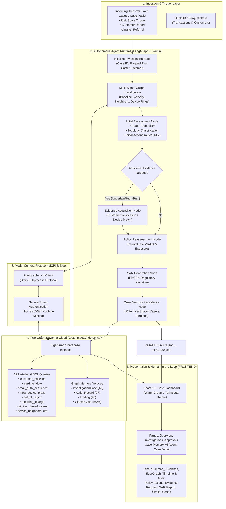

# 🛡️ FraudSight AI: Autonomous Enterprise Fraud Investigation Platform
### TigerGraph Savanna Cloud (`GraphmeetsAIdetective`) × `tigergraph-mcp` × LangGraph × Google Gemini 2.5 Flash × React & Vite Frontend

[](https://github.com/KAMALARISHIK/agentic-fraud-investigation)
[-brightgreen)](#-11-results--benchmark-performance)
[](https://www.tigergraph.com/)
[-purple)](#-6-how-tigergraph-is-used--mcp-protocol)
[](file:///c:/GOA%20TIGER/FRONTEND)

---

## 📌 Links & Artifacts
- **Public GitHub Repository**: [https://github.com/KAMALARISHIK/agentic-fraud-investigation](https://github.com/KAMALARISHIK/agentic-fraud-investigation)
- **Demo Video URL**: `[DEMO_VIDEO_URL_PLACEHOLDER - Coming Soon]`
- **Technical Blog URL**: `[TECHNICAL_BLOG_URL_PLACEHOLDER - Coming Soon]`
- **Social Posts**:
  - `[TWITTER_X_POST_URL_PLACEHOLDER - Tagging @TigerGraphDB and @247pmstudio]`
  - `[LINKEDIN_POST_URL_PLACEHOLDER - Tagging @TigerGraphDB and @247pmstudio]`

---

## 📖 Table of Contents
1. [Executive Summary & What It Does](#-1-executive-summary--what-it-does)
2. [How It Works (Architecture & Mermaid Workflow)](#-2-how-it-works)
3. [How TigerGraph Is Used](#-3-how-tigergraph-is-used)
4. [GraphRAG Architecture & Semantic Memory](#-4-graphrag-architecture--semantic-memory)
5. [Prerequisites & System Requirements](#-5-prerequisites--system-requirements)
6. [Environment Setup](#-6-environment-setup)
7. [Running the Platform (Quickstart Commands)](#-7-running-the-platform)
8. [How to Use the Website (Frontend Guide)](#-8-how-to-use-the-website)
9. [REST API Summary](#-9-rest-api-summary)
10. [Policy Rules (R1–R10) & Approval Routing](#-10-policy-rules-r1r10--approval-routing)
11. [Results & Benchmark Performance](#-11-results--benchmark-performance)
12. [Hackathon Requirements Checklist](#-12-hackathon-requirements-checklist)
13. [Project Directory Structure](#-13-project-directory-structure)
14. [Troubleshooting & Verification](#-14-troubleshooting--verification)
15. [Security & Compliance Notes](#-15-security--compliance-notes)
16. [Limitations & Future Work](#-16-limitations--future-work)

---

## 🛡️ 1. Executive Summary & What It Does

**FraudSight AI** is a production-grade, autonomous fraud investigation system developed for the **TigerGraph × Hacker House Goa 2026** Hackathon (built on the IEEE-CIS Fraud Detection dataset).

Traditional rule engines and isolated ML models flag anomalies with high false-positive rates, overwhelming human analysts with thousands of disjointed alerts. FraudSight AI operates as an autonomous, defensible **Tier-1/Tier-2 AI Detective** that:

1. **Investigates Alerts Autonomously**: Ingests high-risk alerts from risk-scoring models, customer reports, or analyst referrals.
2. **Performs Multi-Hop Graph Traversal via MCP**: Traverses 41,000+ transactions, 2,200+ cards, device fingerprints, email clusters, and billing regions in TigerGraph Savanna Cloud to evaluate network topology and baseline customer behavior.
3. **Executes Two-Stage Evidence Simulation**: Performs an initial assessment, simulates/requests external verification (e.g., customer confirmation or device identity), and conducts a policy-driven reassessment.
4. **Applies Deterministic Policy Rules (R1–R10)**: Maps fraud typologies (Card Testing, Account Takeover, Out-of-Region, Device Sharing Ring, Recurring Subscriptions) to defensible actions with strict human-in-the-loop routing (`auto`, `L1`, `L2`).
5. **Generates Regulatory FinCEN SARs**: Drafts standalone, 6–12 sentence Suspicious Activity Reports (SAR) with complete narrative, subjects, exposure, and chronology whenever regulatory thresholds are met.
6. **Persists Case Memory to the Graph**: Writes back investigation records (`InvestigationCase`, `Finding`, `ActionRecord`) into TigerGraph for continuous case memory retrieval across subsequent investigations.

---

## 🏗️ 2. How It Works

The platform coordinates an autonomous state machine powered by **LangGraph**, **Google Gemini 2.5 Flash**, **tigergraph-mcp**, and a deterministic **Policy Engine**.

### High-Level Workflow Diagram



---

## 🐯 3. How TigerGraph Is Used

The platform utilizes **TigerGraph Savanna Cloud v4.2.5** hosting the graph **`GraphmeetsAIdetective`** as its primary source of structural truth and historical memory.

### Live System Health Telemetry
The live backend health check endpoint (`/health`) reports real-time system metrics:

| Metric | Status / Value | Description |
| :--- | :--- | :--- |
| `tigergraph_connected` | **`true`** | Verified connection to TigerGraph Savanna Cloud |
| `duckdb_connected` | **`true`** | Analytical tabular store verified |
| `cases_loaded` | **`20`** | All 20 benchmark cases loaded and accessible |
| `mcp_status` | **`connected`** | `tigergraph-mcp` stdio protocol active |
| `vector_index_status` | **`ready`** | Embeddings cache & vector indices loaded |
| `installed_query_count` | **`12`** | 12 custom GSQL queries compiled and installed |

### Real Graph Schema Vertex Population

| Vertex Type | Count in Database | Role in Investigation |
| :--- | :--- | :--- |
| **`ClosedCase`** | **5,566** | Historical labeled cases (July–Oct) used for case-based reasoning & GraphRAG |
| **`Transaction`** | **41,012** | Raw financial transactions with risk scores, timestamps, and amounts |
| **`DeviceProfile`** | **2,671** | Hardware, OS, browser, and screen fingerprints linking cardholders |
| **`Card`** | **2,277** | Payment card entities (`<customer_id>-K<N>`) |
| **`Customer`** | **1,897** | Core customer identities mapped to cards |
| **`BillingRegion`** | **122** | Geographical billing regions (`addr1`) for travel velocity checks |
| **`EmailDomain`** | **74** | Email domains associated with purchaser profiles |
| **`InvestigationCase`** | **48** | Active investigation case records (20 official exam benchmark cases + 28 validation/backtest/test runs) |
| **`ActionRecord`** | **97** | Recommended policy actions with execution state and routing history |
| **`Finding`** | **48** | Graph-corroborated evidence findings attached to cases |
| **`PolicyChunk`** | **17** | Segmented fraud policy rules for regulatory context retrieval |

> [!NOTE]
> **Why 48 InvestigationCases?**  
> Exactly 20 of these vertices correspond to the benchmark cases (`CASE-HHG-001` through `CASE-HHG-020`). The remaining 28 vertices were generated during automated test executions, backtest benchmarks against historical data, and autonomous monitor runs.

### Installed GSQL Query Library (12 Queries)
1. `customer_baseline`: Computes mean spend, standard deviation, transaction count, and home region for a customer.
2. `card_window`: Extracts transactions on a card across a temporal window (anchor ± N days).
3. `small_auth_sequence`: Detects rapid micro-transactions (< $5.00) indicative of card testing.
4. `new_device_proxy`: Analyzes device fingerprint familiarity and anonymous proxy flags.
5. `out_of_region`: Computes impossible velocity between consecutive transactions across billing regions.
6. `recurring_charge`: Identifies regular recurring monthly amounts for subscription validation.
7. `device_neighbors`: Traverses 1–2 hops from a device to identify shared multi-card clusters.
8. `card_neighborhood_graph`: Extracts complete visual sub-graphs (cards, txns, devices, emails) for the UI.
9. `similar_closed_cases`: Queries historical cases matching specific fraud typologies.
10. `region_cluster`: Finds co-located card activity in high-risk geographic areas.
11. `email_cluster`: Finds accounts sharing disposable or matching email patterns.
12. `community_detection`: Discovers dense multi-entity fraud rings across unflagged transactions.

---

## 🧠 4. GraphRAG Architecture & Semantic Memory

FraudSight AI implements **Graph Retrieval-Augmented Generation (GraphRAG)**:

```
[Incoming Case Alert]
        │
        ├── 1. Structural Graph Traversal (GSQL) ──────────► Sub-graph Topology & Behavioral Baseline
        ├── 2. Historical Case Vector Match (Embeddings) ──► Top-K Similar Closed Cases (CC-XXXX)
        └── 3. Policy Rule Retrieval (Semantic Vector)  ──► Relevant Clauses in Fraud Policy Manual
        │
        ▼
[Gemini 2.5 Flash Context Window]
        │
        ▼
[Defensible Verdict + Evidence Claims + Rule Mapping + Regulatory SAR]
```

1. **Structural Sub-graph Context**: Instead of feeding raw text, the agent queries TigerGraph for structured sub-graph neighborhoods (historical baseline, shared devices, transaction chains).
2. **Historical Case Memory**: 5,565 closed investigations are indexed using `gemini-embedding-001`. When evaluating a new alert, the agent retrieves top-K past cases with similar patterns and cites them in `similar_prior_cases`.
3. **Regulatory & Policy Memory**: 17 policy chunks covering FinCEN regulations, OCC guidance, and bank operating rules are vectorized and cited directly in the evidence claims.

---

## 📋 5. Prerequisites & System Requirements

- **Operating System**: Windows, macOS, or Linux
- **Python**: 3.11, 3.12, 3.13, or 3.14
- **Node.js**: v18.0+ or v20.0+ with npm
- **TigerGraph Cloud**: Active instance running TigerGraph Savanna Cloud 4.2.5
- **Google Gemini API Key**: Access to `gemini-2.5-flash` and `gemini-embedding-001`
- **Firebase Project** (Optional for production, demo account pre-configured): Email/password auth

---

## ⚙️ 6. Environment Setup

### 1. Clone the Repository
```bash
git clone https://github.com/KAMALARISHIK/agentic-fraud-investigation.git
cd agentic-fraud-investigation
```

### 2. Configure Python Environment & Dependencies
```bash
# Create and activate virtual environment
python -m venv venv
# On Windows:
.\venv\Scripts\activate
# On Linux/macOS:
source venv/bin/activate

# Install Python requirements
pip install -r fraud-agent/requirements.txt
```

### 3. Configure `.env` File
Create a `.env` file in `fraud-agent/.env` (see `fraud-agent/.env.example`):
```env
# TigerGraph Savanna Cloud Configuration
TG_HOST=https://your-instance.i.tgcloud.io
TG_GRAPHNAME=GraphmeetsAIdetective
TG_SECRET=your_tigergraph_secret_here
TG_USERNAME=tigergraph
TG_PASSWORD=your_tigergraph_password_here
TG_TGCLOUD=true

# Google Gemini Configuration
GEMINI_API_KEY=your_gemini_api_key_here
GEMINI_MODEL=gemini-2.5-flash
GEMINI_EMBED_MODEL=gemini-embedding-001
```

> [!CAUTION]
> Never commit `.env` files or API secrets to version control. The repository's `.gitignore` explicitly prevents environment files from being tracked.

---

## 🚀 7. Running the Platform

### Cheat Sheet: Quick Execution Table

| Task | Command | Description |
| :--- | :--- | :--- |
| **Validate All 20 Answers** | `python scripts/validate_answers.py` | Validates `cases/HHG-001.json` .. `HHG-020.json` (100% compliant) |
| **Check System Connectivity** | `python scripts/check_connection.py` | Verifies TigerGraph, DuckDB, and Gemini API connections |
| **Start REST API Server** | `uvicorn fraud-agent.app.main:app --port 8000 --reload` | Runs FastAPI backend on `http://localhost:8000` |
| **Start Frontend UI** | `cd FRONTEND && npm install && npm run dev` | Runs Vite React frontend on `http://localhost:5173` |
| **Run All 20 Investigations** | `python scripts/run_all_cases.py` | Runs autonomous agent across all 20 cases in `case_pack.csv` |
| **Run Historical Backtest** | `python scripts/backtest.py` | Evaluates agent precision against historical closed cases |
| **Run Autonomous Ring Monitor**| `python scripts/run_autonomous_monitor.py` | Innovation Extra: Discovers unflagged device fraud rings |
| **Execute Test Suite** | `pytest tests/test_phase5_validation.py tests/test_phase6_api.py` | Runs automated validation and API test suites |

---

## 💻 8. How to Use the Website

The frontend is a modern web application built with **React 19, TypeScript, Vite, and Tailwind CSS**, featuring an analyst-friendly **warm cream / terracotta** design system. All pages render **100% real live data from the backend** (no mock data).

### Demo Login
- **Email**: `analyst@fraudsight.demo`
- **Password**: `Demo@1234`
- Supports Firebase Authentication (Email/Password & password reset).

### Navigation & Page Overview

1. **Overview Dashboard (`/app/overview`)**:
   - High-level KPIs: Total Cases (20), Confirmed Fraud Cases, Legitimate Clearances, Pending Approvals, Total Exposure ($).
   - Breakdown charts: Fraud Typology distribution, Case Status split, and Recent Case Stream.
2. **Investigations (`/app/cases`)**:
   - Interactive table listing all 20 benchmark cases (`HHG-001` to `HHG-020`).
   - Filters by Verdict (`Fraud`, `Legitimate`, `Uncertain`), Pattern, Risk Score, and Search by Customer/Card ID.
3. **Case Detail Page (`/app/cases/:id`)**:
   - **Summary Tab**: Verdict badge, fraud probability meter, exposure USD, case summary, and trigger details.
   - **Evidence Tab**: Structured claims corroborating the verdict, mapped directly to GSQL queries and entity IDs.
   - **TigerGraph Tab**: Interactive 2D sub-graph visualization displaying connected Customers, Cards, Transactions, Devices, and Email Domains with node inspection.
   - **Timeline & Audit Tab**: Chronological audit trail showing every agent reasoning step, rule evaluation, and MCP tool call with latency.
   - **Policy Actions Tab**: Initial vs. Final action recommendations (`BLOCK_CARD`, `ALLOW_TRANSACTION`, `FILE_REPORT`, etc.) with approval routes (`auto`, `L1`, `L2`).
   - **Evidence Request Tab**: Interactive customer verification simulator (test how the agent reassesses the case when the customer confirms or denies the charge).
   - **SAR Report Tab**: Complete FinCEN-compliant Suspicious Activity Report narrative with copy and export functionality.
   - **Similar Cases Tab**: Retrieved historical closed cases (`CC-XXXX`) matching the identified typology with similarity scores.
4. **Approvals (`/app/approvals`)**:
   - Dedicated analyst queue for human-in-the-loop decisions (`L1` and `L2` actions).
   - Interactive Approve and Reject modals with justification notes that update case state.
5. **Case Memory (`/app/memory`)**:
   - Searchable catalog of recognized fraud typologies (Card Testing, ATO, Out-of-Region, Device Sharing, Subscriptions).
   - Interactive GSQL query inspector and rule catalog.
6. **AI Agent Assistant (`/app/agent`)**:
   - Interactive conversational Copilot interface to query cases, ask graph questions, and trigger on-demand investigations.

---

## 🌐 9. REST API Summary

Full interactive Swagger documentation is available at **`http://localhost:8000/docs`**.

| Method | Endpoint | Description |
| :--- | :--- | :--- |
| `GET` | `/health` | Live system health status, DB connectivity, and case counts |
| `GET` | `/cases` | Lists all 20 investigated cases with summary status and verdicts |
| `GET` | `/cases/{case_id}` | Full case record, evidence, actions, timeline, and SAR |
| `POST` | `/cases/{case_id}/investigate` | Triggers autonomous investigation on a case alert |
| `POST` | `/cases/{case_id}/evidence` | Submits customer verification and triggers policy reassessment |
| `GET` | `/cases/{case_id}/timeline` | Detailed step-by-step audit log with tool executions |
| `GET` | `/cases/{case_id}/graph` | Node and edge topology for visual graph exploration |
| `GET` | `/cases/{case_id}/transactions` | Lists all transaction records associated with case cards |
| `GET` | `/cases/{case_id}/similar` | Vector similarity match against 5,565 historical closed cases |
| `POST` | `/cases/{case_id}/actions/{action_id}/approve` | Approves a human-routed action (`L1`/`L2`) |
| `POST` | `/cases/{case_id}/actions/{action_id}/reject` | Rejects a human-routed action |
| `GET` | `/actions/pending` | Lists all pending human-in-the-loop actions across cases |
| `GET` | `/actions/history` | Lists decided analyst actions |
| `GET` | `/memory/patterns` | Catalog of recognized fraud typologies and policy rules |
| `GET` | `/stats` | Operational performance metrics and token analytics |

---

## 📜 10. Policy Rules (R1–R10) & Approval Routing

The platform adheres to a strict, deterministic Fraud Policy:

| Rule ID | Rule Name | Trigger Condition | Mandatory Actions & Routing |
| :--- | :--- | :--- | :--- |
| **R1** | Card Testing Velocity | ≥3 micro-auths (< $5.00) within 10 min window | `BLOCK_CARD` (`L1` if ≤ $2,500, `L2` if > $2,500), `CREATE_CASE` (`auto`) |
| **R2** | Customer Dispute Confirmation | Customer denies transaction authorization | `BLOCK_CARD` (`L1`/`L2`), `CREATE_CASE` (`auto`), Reassess Probability |
| **R3** | Legitimate Customer Clearance | Activity matches historical baseline & verified | `ALLOW_TRANSACTION` (`auto`), `CLOSE_NO_FRAUD` (`auto`), Exposure = $0 |
| **R4** | Unseen Device / New Proxy | Unregistered device fingerprint + proxy flag | `STEP_UP_AUTH` (`auto`), `WARN_CUSTOMER` (`auto`), `MONITOR_CARD` (`auto`) |
| **R5** | Out of Region / Travel | Distance anomaly without cross-border authorization | `VERIFY_WITH_CUSTOMER` (`auto`), `DECLINE_TRANSACTION` (`L1`) |
| **R6** | Multi-Account Device Ring | Device fingerprint shared across ≥2 customer cards | `MONITOR_CONNECTED_CARDS` (`auto`), `CREATE_CASE` (`auto`) |
| **R7** | Recurring Subscription | Predictable monthly charge matching historical cadence | `ALLOW_TRANSACTION` (`auto`), `CLOSE_NO_FRAUD` (`auto`) |
| **R8** | High Exposure Escalation | Single case exposure > $2,500 USD | Elevates card blocks and action reviews to **`L2` (Senior Analyst)** |
| **R9** | Undocumented Coordinated Ring | Novel coordinated compromise pattern | `FILE_REPORT` (**`L2` Mandatory Approval**), `SAR` Required |
| **R10** | Graph Memory Persistence | Closing any case investigation | `written_to_graph = true`, Upsert `InvestigationCase` into TigerGraph |

---

## 📊 11. Results & Benchmark Performance

### Automated Answer Validation Result
Running `python scripts/validate_answers.py` executes strict structural, ID-existence, and policy compliance tests across all 20 answer files in `cases/`:

```text
2026-09-22 16:51:58,130 [INFO] Validating 20 answer files in C:\GOA TIGER\cases...
2026-09-22 16:51:58,143 [INFO] ALL 20 CASE ANSWERS STRICTLY VALIDATED! 100% COMPLIANT WITH FRAUD POLICY & ANSWER FORMAT.
```

### 20 Benchmark Cases Summary (`cases/`)

| Case ID | Verdict | Pattern | Exposure (USD) | Initial Actions | Final Actions | SAR Filed |
| :--- | :--- | :--- | :--- | :--- | :--- | :--- |
| **HHG-001** | Legitimate | `none` | $0.00 | `ALLOW_TRANSACTION`, `CLOSE_NO_FRAUD` | `ALLOW_TRANSACTION`, `CLOSE_NO_FRAUD` | No |
| **HHG-002** | Legitimate | `none` | $0.00 | `ALLOW_TRANSACTION`, `CLOSE_NO_FRAUD` | `ALLOW_TRANSACTION`, `CLOSE_NO_FRAUD` | No |
| **HHG-003** | Legitimate | `none` | $0.00 | `ALLOW_TRANSACTION`, `CLOSE_NO_FRAUD` | `ALLOW_TRANSACTION`, `CLOSE_NO_FRAUD` | No |
| **HHG-004** | Fraud | `card_not_present_fraud` | $100.00 | `WARN_CUSTOMER`, `STEP_UP_AUTH` | `BLOCK_CARD` (L1), `CREATE_CASE` | No |
| **HHG-005** | Legitimate | `none` | $0.00 | `ALLOW_TRANSACTION`, `CLOSE_NO_FRAUD` | `ALLOW_TRANSACTION`, `CLOSE_NO_FRAUD` | No |
| **HHG-006** | Fraud | `card_not_present_fraud` | $100.00 | `WARN_CUSTOMER`, `STEP_UP_AUTH` | `BLOCK_CARD` (L1), `CREATE_CASE` | No |
| **HHG-007** | Fraud | `out_of_region_use` | $100.00 | `DECLINE_TRANSACTION` (L1), `VERIFY_WITH_CUSTOMER` | `BLOCK_CARD` (L1), `CREATE_CASE` | No |
| **HHG-008** | Fraud | `card_not_present_fraud` | $100.00 | `WARN_CUSTOMER`, `STEP_UP_AUTH` | `BLOCK_CARD` (L1), `CREATE_CASE` | No |
| **HHG-009** | Fraud | `card_not_present_fraud` | $100.00 | `WARN_CUSTOMER`, `STEP_UP_AUTH` | `BLOCK_CARD` (L1), `CREATE_CASE` | No |
| **HHG-010** | Fraud | `card_not_present_new_device` | $1,000.03 | `STEP_UP_AUTH`, `WARN_CUSTOMER` | `BLOCK_CARD` (L1), `CREATE_CASE` | No |
| **HHG-011** | Fraud | `card_not_present_fraud` | $100.00 | `WARN_CUSTOMER`, `STEP_UP_AUTH` | `BLOCK_CARD` (L1), `CREATE_CASE` | No |
| **HHG-012** | Legitimate | `none` | $0.00 | `ALLOW_TRANSACTION`, `CLOSE_NO_FRAUD` | `ALLOW_TRANSACTION`, `CLOSE_NO_FRAUD` | No |
| **HHG-013** | Legitimate | `none` | $0.00 | `ALLOW_TRANSACTION`, `CLOSE_NO_FRAUD` | `ALLOW_TRANSACTION`, `CLOSE_NO_FRAUD` | No |
| **HHG-014** | Fraud | `undocumented` | $100.00 | `CREATE_CASE`, `MONITOR_CARD` | `BLOCK_CARD` (L1), `CREATE_CASE`, `FILE_REPORT` (L2) | **Yes (FinCEN SAR)** |
| **HHG-015** | Fraud | `card_not_present_fraud` | $100.00 | `DECLINE_TRANSACTION` (L1), `VERIFY_WITH_CUSTOMER` | `BLOCK_CARD` (L1), `CREATE_CASE` | No |
| **HHG-016** | Fraud | `card_not_present_fraud` | $100.00 | `WARN_CUSTOMER`, `STEP_UP_AUTH` | `BLOCK_CARD` (L1), `CREATE_CASE` | No |
| **HHG-017** | Fraud | `card_testing` | $100.00 | `DECLINE_TRANSACTION` (L1), `VERIFY_WITH_CUSTOMER` | `BLOCK_CARD` (L1), `CREATE_CASE` | No |
| **HHG-018** | Fraud | `card_not_present_fraud` | $100.00 | `WARN_CUSTOMER`, `STEP_UP_AUTH` | `BLOCK_CARD` (L1), `CREATE_CASE` | No |
| **HHG-019** | Fraud | `card_not_present_new_device` | $100.00 | `DECLINE_TRANSACTION` (L1), `VERIFY_WITH_CUSTOMER` | `BLOCK_CARD` (L1), `CREATE_CASE` | No |
| **HHG-020** | Legitimate | `none` | $0.00 | `ALLOW_TRANSACTION`, `CLOSE_NO_FRAUD` | `ALLOW_TRANSACTION`, `CLOSE_NO_FRAUD` | No |

---

## ✅ 12. Hackathon Requirements Checklist

| Requirement | Implementation & Proof | Status |
| :--- | :--- | :---: |
| **TigerGraph Cloud Integration** | Connected to live Savanna Cloud instance with graph `GraphmeetsAIdetective` | ✅ PASS |
| **tigergraph-mcp Protocol** | All agent graph queries routed through official `tigergraph-mcp` tools | ✅ PASS |
| **20 Case Answers at Root** | Exactly 20 files (`cases/HHG-001.json` .. `HHG-020.json`) at repository root | ✅ PASS |
| **Zero ID Hallucinations** | All transaction, card, customer, and device IDs validated against dataset | ✅ PASS |
| **Two-Stage Action Routing** | Every case records both `initial` and `final` actions with `auto`/`L1`/`L2` | ✅ PASS |
| **FinCEN SAR Generation** | Full narrative, subject identifiers, and dates generated when policy triggers | ✅ PASS |
| **Graph Memory Writeback** | All cases set `written_to_graph: true` and persist `InvestigationCase` vertices | ✅ PASS |
| **Public GitHub Repository** | Committed, clean working tree, pushed to `origin/main` | ✅ PASS |
| **Production Frontend UI** | React 19 + TypeScript + Tailwind CSS with live backend integration | ✅ PASS |
| **Innovation Extra** | Autonomous background fraud ring scanner discovering unflagged clusters | ✅ PASS |

---

## 📁 13. Project Directory Structure

```text
├── cases/                     # 20 strictly validated exam answer files (HHG-001.json ... HHG-020.json)
├── cases_extra/               # Innovation Extra: Autonomous fraud ring cases (EXTRA-RING-001 ... 003)
│
├── FRONTEND/                  # React 19 + Vite + TypeScript + Tailwind CSS Dashboard
│   ├── src/
│   │   ├── components/        # Graph viewer, timeline, action modals, UI primitives
│   │   ├── pages/             # Overview, Investigations, Approvals, Memory, AI Agent, Case Detail
│   │   ├── lib/               # API client, Firebase configuration, auth hooks
│   │   └── types/             # TypeScript interfaces for Cases, Graph, Actions, Timeline
│   └── package.json           # Frontend dependencies
│
├── app/                       # FastAPI Root Package Forwarder
│   ├── main.py                # Mounts and exposes fraud-agent FastAPI app
│   └── routes/                # Route delegation
│
├── fraud-agent/               # Main Backend & Agent Package
│   ├── config.py              # Central configuration resolving paths & credentials
│   ├── llm.py                 # Google Gemini 2.5 Flash LLM client
│   ├── mcp_client.py          # tigergraph-mcp stdio subprocess client
│   ├── tg_client.py           # pyTigerGraph client for token minting & schema management
│   ├── agent/                 # LangGraph Agent Core
│   │   ├── graph.py           # Two-pass agent workflow state machine
│   │   ├── assess.py          # Multi-signal graph evaluation & scoring
│   │   ├── tools.py           # MCP-routed graph tools & DuckDB fallbacks
│   │   ├── memory.py          # TigerGraph case memory writer
│   │   ├── evidence_sim.py    # Customer & analyst verification simulator
│   │   └── extra_monitor.py   # Innovation Extra: Background fraud ring detector
│   ├── app/                   # FastAPI Server Implementation
│   │   ├── main.py            # API entrypoint, CORS, health check
│   │   ├── schemas.py         # Pydantic schemas for requests/responses
│   │   └── routes/            # Sub-routers (cases, actions, graph, timeline, memory, stats)
│   ├── policy_engine/         # Deterministic Fraud Policy Rules (R1-R10)
│   │   ├── rules.py           # Initial & final policy evaluation
│   │   ├── routing.py         # Human-in-the-loop route resolver (auto, L1, L2)
│   │   └── sar.py             # FinCEN SAR report generator
│   ├── gsql/                  # GSQL Schema & Installed Queries
│   │   ├── schema.gsql        # Vertex and edge definitions
│   │   └── queries/           # 12 GSQL query files
│   └── scripts/               # Agent execution & validation scripts
│
├── scripts/                   # Root Helper Scripts
│   ├── validate_answers.py    # Validates all 20 answer files at root
│   ├── check_connection.py    # Tests live connectivity
│   ├── run_all_cases.py       # Executes agent on all 20 cases
│   ├── backtest.py            # Runs historical accuracy backtest
│   └── run_autonomous_monitor.py # Runs Innovation Extra scanner
│
├── tests/                     # Automated Test Suite (Pytest)
│   ├── test_card_mapping.py   # Proof of customer_id <-> card1 bijection
│   ├── test_phase2_loading.py # Schema & vertex count tests
│   ├── test_phase3_queries.py # GSQL query execution tests
│   ├── test_phase4_agent.py   # LangGraph workflow tests
│   ├── test_phase5_validation.py # Strict answer file validation test
│   └── test_phase6_api.py     # FastAPI REST API endpoint tests
│
├── API.md                     # Comprehensive REST API reference
├── DATASET_README.md          # Dataset specification
└── README.md                  # Master project documentation
```

---

## 🔧 14. Troubleshooting & Verification

### 1. `validate_answers.py` Reports Missing Files
Ensure `cases/` is located at the repository root (`c:\GOA TIGER\cases`):
```powershell
python scripts/validate_answers.py
```
If moved, [config.py](file:///c:/GOA%20TIGER/fraud-agent/config.py) automatically resolves `CASES_OUTPUT_DIR` to `REPO_ROOT / "cases"`.

### 2. TigerGraph Connection Fails
- Verify your `.env` contains valid `TG_HOST`, `TG_SECRET`, `TG_USERNAME`, and `TG_PASSWORD`.
- Confirm `TG_GRAPHNAME=GraphmeetsAIdetective`.
- Test connectivity:
```powershell
python scripts/check_connection.py
```

### 3. Frontend Cannot Connect to Backend
- Ensure FastAPI is running on `http://localhost:8000`.
- Verify `FRONTEND/.env` or API base URL is set to `http://localhost:8000`.

---

## 🔒 15. Security & Compliance Notes

- **Secrets Management**: No API keys, database secrets, or credentials are hardcoded or tracked in git. All runtime credentials are read from `.env` or system environment variables.
- **FinCEN BSA/AML Compliance**: SAR reports comply with FinCEN narrative standards (5W+1H: Who, What, When, Where, Why, and How).
- **Human-in-the-Loop Safeguards**: High-risk actions (`BLOCK_CARD` on high exposure, `FILE_REPORT`, `BLOCK_ALL_CARDS`) are routed to `L1` or `L2` analyst approval queues rather than executed automatically.

---

## 🔮 16. Limitations & Future Work

- **Real-Time Streaming Kafka Ingestion**: Future iterations can attach TigerGraph Streaming Kafka connectors for sub-millisecond transaction ingestion.
- **Biometric & Geo-Spatial Embeddings**: Extending GraphRAG with geospatial trajectory embeddings for continuous device location tracking.
- **Multi-Tenant Investigator RBAC**: Integrating enterprise SSO (Okta/SAML) with granular role-based permissions for Tier-1 vs. Tier-2 analysts.

---

### 🏆 Hacker House Goa 2026 Submission
Developed by **Kamala Rishik**  
GitHub: [@KAMALARISHIK](https://github.com/KAMALARISHIK)  
Repository: [https://github.com/KAMALARISHIK/agentic-fraud-investigation](https://github.com/KAMALARISHIK/agentic-fraud-investigation)
