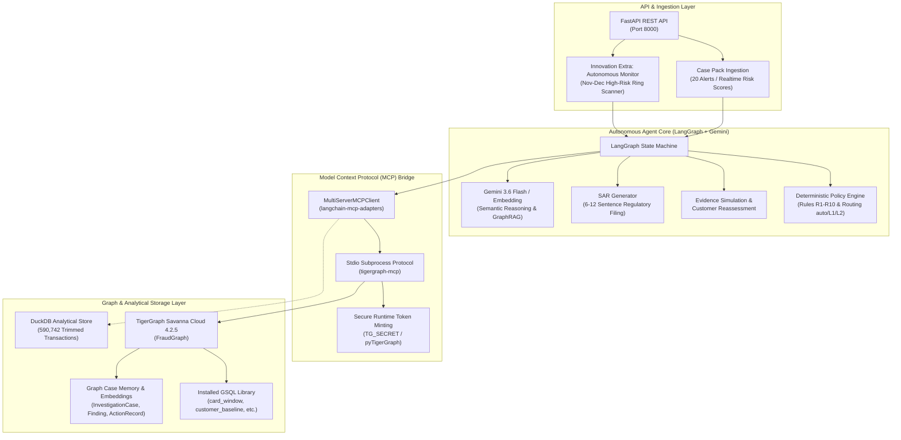

# 🛡️ FraudSight AI: Autonomous Enterprise Fraud Investigation Platform
### TigerGraph Savanna Cloud (FraudGraph) × `tigergraph-mcp` × LangGraph × Google Gemini 3.6 Flash × React & Vite Frontend

---

## 📖 Table of Contents
1. [Executive Summary](#-1-executive-summary)
2. [Quickstart: How to Use What (Cheat Sheet)](#-2-quickstart-how-to-use-what-cheat-sheet)
3. [Repository Structure: What Each File Does](#-3-repository-structure-what-each-file-does)
4. [Environment Setup & Prerequisites](#-4-environment-setup--prerequisites)
5. [Detailed Usage Guides for Every Script & Component](#-5-detailed-usage-guides-for-every-script--component)
   - [5.1 Connection Verification](#51-connection-verification)
   - [5.2 Validating the 20 Exam Answers](#52-validating-the-20-exam-answers)
   - [5.3 Running the Autonomous Investigation Agent](#53-running-the-autonomous-investigation-agent)
   - [5.4 Historical Backtest Benchmark](#54-historical-backtest-benchmark)
   - [5.5 Innovation Extra: Autonomous Fraud Ring Monitor](#55-innovation-extra-autonomous-fraud-ring-monitor)
   - [5.6 Running the FastAPI REST API Server](#56-running-the-fastapi-rest-api-server)
   - [5.7 Running the Automated Test Suite](#57-running-the-automated-test-suite)
6. [Architecture & tigergraph-mcp Protocol Routing](#-6-architecture--tigergraph-mcp-protocol-routing)
7. [Policy Rules (R1–R10) & Routing Engine Reference](#-7-policy-rules-r1r10--routing-engine-reference)
8. [REST API Endpoints Reference](#-8-rest-api-endpoints-reference)
9. [Running Frontend & Backend (Exact Commands)](#-9-running-frontend--backend-exact-commands)
10. [License & Acknowledgments](#-10-license--acknowledgments)

---

## 📌 1. Executive Summary

This repository contains the complete backend and autonomous engine for an **Enterprise Fraud Investigation Agent** developed for the **TigerGraph × Hacker House Goa** Hackathon (IEEE-CIS Fraud Dataset Edition).

### Core Capabilities:
- **100% Graph-Routed Operations via MCP**: All graph queries, traversals, entity mutations, and vector searches in the agent runtime path execute through `tigergraph-mcp` stdio tools (`MultiServerMCPClient`).
- **Autonomous Multi-Signal Graph Investigation**: Evaluates chronological card windows, baseline customer behavior, micro-authorization velocity, device sharing, geographic impossible velocity, and recurring subscriptions.
- **Deterministic Policy Compliance (R1–R10)**: Strict rule-based policy engine mapping verdicts and approval routing (`auto`, `L1`, `L2`).
- **Two-Pass Evidence Simulation**: Reassesses initial findings dynamically upon customer verification or evidence submission.
- **FinCEN-Defensible SAR Generation**: Generates 6–12 sentence standalone Suspicious Activity Reports detailing chronological events, exposure, suspect entities, and typologies.
- **Production REST API Layer**: Full-featured FastAPI server with interactive Swagger UI, real-time timeline auditing, and visual graph topology streaming.

---

## ⚡ 2. Quickstart: How to Use What (Cheat Sheet)

| What You Want to Do | Command to Run | What It Does / Expected Output |
| :--- | :--- | :--- |
| **Verify Setup** | `python scripts/check_connection.py` | Tests TigerGraph Cloud, DuckDB, & Gemini API connectivity |
| **Validate Answers** | `python scripts/validate_answers.py` | Validates all 20 exam JSON files (`cases/HHG-001.json`..`020.json`) |
| **Run Agent on 20 Cases** | `python scripts/run_all_cases.py` | Runs the LangGraph + MCP agent across all 20 alert cases |
| **Run Historical Backtest** | `python scripts/backtest.py` | Evaluates agent precision/recall on historical closed cases |
| **Run Innovation Extra** | `python scripts/run_autonomous_monitor.py` | Scans unflagged data to discover multi-account device fraud rings |
| **Start REST API Server** | `cd fraud-agent && uvicorn app.main:app --reload --port 8000` | Starts FastAPI on `http://localhost:8000` (Swagger: `/docs`) |
| **Start Frontend UI** | `cd FRONTEND && npm install && npm run dev` | Starts Vite React frontend on `http://localhost:5173` |
| **Build Frontend** | `cd FRONTEND && npm run build` | Builds production bundle into `FRONTEND/dist/` |
| **Run Test Suite** | `pytest -q` | Executes all 28 unit & integration tests (100% pass) |

---

## 📂 3. Repository Structure: What Each File Does

```text
├── cases/                     # 20 strictly validated exam answer files (HHG-001.json ... HHG-020.json)
├── cases_extra/               # Innovation Extra: Autonomous fraud ring cases (EXTRA-RING-001 ... 003)
│
├── FRONTEND/                  # Modern React 19 + Vite + Tailwind CSS Investigation Dashboard
│   ├── src/
│   │   ├── components/        # UI components, Graph Viewer, Timeline, Case Details, Action Modals
│   │   ├── services/          # API client calling FastAPI backend (/cases, /graph, /timeline, etc.)
│   │   └── types/             # TypeScript interfaces for Cases, Graph Nodes/Edges, Actions, Timeline
│   └── package.json           # Frontend dependencies and Vite build scripts
│
├── app/                       # FastAPI REST API Backend
│   ├── main.py                # Server entrypoint with CORS, health check, and route mounting
│   ├── schemas.py             # Pydantic models for cases, actions, graphs, and stats
│   └── routes/                # Endpoints (cases, timeline, graph, actions, memory, stats, extra)
│
├── agent/                     # Autonomous LangGraph Agent Core
│   ├── graph.py               # Two-pass agent orchestration and state machine
│   ├── assess.py              # Multi-signal graph evaluation and pattern matching
│   ├── tools.py               # MCP-routed graph tools with DuckDB analytical fallbacks
│   ├── memory.py              # Case, Finding, and ActionRecord persistence into TigerGraph
│   ├── evidence_sim.py        # Customer & analyst verification response simulator
│   └── extra_monitor.py       # Innovation Extra: Background scanner for unflagged device clusters
│
├── policy_engine/             # Enterprise Fraud Policy Rules & Routing
│   ├── rules.py               # Deterministic R1-R10 rule evaluation (initial & final)
│   ├── routing.py             # Action approval routing (auto, L1, L2)
│   └── sar.py                 # FinCEN-compliant Suspicious Activity Report (SAR) generator
│
├── gsql/                      # TigerGraph Schema & GSQL Query Library
│   ├── schema.gsql            # Graph schema definition (Vertices, Edges, Graph)
│   ├── create_schema.py       # Script applying schema to TigerGraph
│   ├── install_queries.py     # Script compiling all 12 GSQL queries
│   └── queries/               # 12 GSQL query files (card_window, customer_baseline, etc.)
│
├── data_loading/              # Ingestion & Vector Embedding Pipeline
│   ├── prepare.py             # Ingests CSVs into DuckDB and creates Parquet partitions
│   ├── load_graph.py          # Batch loads entities & edges into TigerGraph
│   └── embed_docs.py          # Generates Gemini embeddings for policies and closed cases
│
├── scripts/                   # Command-Line Automation Scripts
│   ├── check_connection.py    # Verifies TigerGraph & Gemini connectivity
│   ├── run_all_cases.py       # Runs agent on all 20 test alerts and writes answer files
│   ├── validate_answers.py    # Validates 100% compliance with Fraud Policy and Answer Format
│   ├── backtest.py            # Evaluates agent accuracy across historical closed cases
│   └── run_autonomous_monitor.py # Runs Innovation Extra fraud ring discovery
│
├── tests/                     # Pytest Regression Test Suite (28/28 tests passing)
│   ├── test_card_mapping.py   # Proof of customer_id <-> card1 bijection
│   ├── test_phase2_loading.py # Validates schema & loaded graph counts
│   ├── test_phase3_queries.py # Validates GSQL queries & MCP tool bindings
│   ├── test_phase4_agent.py   # Tests policy engine, SAR, & LangGraph workflow
│   ├── test_phase5_validation.py # Tests strict validation of all 20 answer files
│   └── test_phase6_api.py     # Tests all FastAPI REST endpoints & HTTP codes
│
├── mcp_client.py              # tigergraph-mcp stdio client with secure runtime token minting
├── tg_client.py               # pyTigerGraph client (used only for data loading & auth token)
├── llm.py                     # Google Gemini 3.6 Flash & Embedding integration
├── config.py                  # Environment variable configuration & settings
├── requirements.txt           # Python dependencies
├── API.md                     # Full REST API endpoint reference and cURL examples
├── DATA_MAPPING.md            # Mathematical proof of customer_id <-> card1 bijection
├── BLOG_DRAFT.md              # Technical blog post on GraphRAG & MCP architecture
├── DATASET_README.md          # Original TigerGraph × Hacker House Goa Dataset Specification
└── README.md                  # This master documentation file
```

---

## ⚙️ 4. Environment Setup & Prerequisites

### 1. Prerequisites
- Python 3.11+
- Live TigerGraph Savanna Cloud instance (v4.2.5) with graph `FraudGraph`
- Google Gemini API key

### 2. Install Dependencies
```powershell
pip install -r requirements.txt
```

### 3. Configure Environment (`.env`)
Create a `.env` file in the root directory (never commit this file):
```env
# TigerGraph Cloud Configuration
TG_HOST=https://your-instance.i.tgcloud.io
TG_GRAPHNAME=FraudGraph
TG_SECRET=your_tigergraph_secret
TG_USERNAME=tigergraph
TG_PASSWORD=your_tigergraph_password
TG_TGCLOUD=true

# Google Gemini Configuration
GEMINI_API_KEY=your_gemini_api_key
GEMINI_MODEL=gemini-3.6-flash
GEMINI_EMBEDDING_MODEL=gemini-embedding-001
```

---

## 🚀 5. Detailed Usage Guides for Every Script & Component

### 5.1 Connection Verification
**Script**: `scripts/check_connection.py`  
**Purpose**: Checks that TigerGraph Savanna Cloud is reachable, the token can be minted, DuckDB is present, and Gemini API responds.
```powershell
python scripts/check_connection.py
```
*Expected Output*:
```
[INFO] TigerGraph Cloud connection OK (Graph: FraudGraph).
[INFO] DuckDB analytical database OK.
[INFO] Google Gemini 3.6 Flash connection OK.
```

---

### 5.2 Validating the 20 Exam Answers
**Script**: `scripts/validate_answers.py`  
**Purpose**: Checks all 20 JSON files in `cases/` against the strict exam criteria:
- JSON structure matches required schema (`case`, `sar`, `actions`, `timeline`).
- All entity IDs (`txn_id`, `card_id`, `device_id`) exist in the actual dataset (0 hallucinations).
- SAR is present for exposure > $10,000 or high-confidence fraud.
- Approval routing correctly matches policy rules (`auto`, `L1`, `L2`).
```powershell
python scripts/validate_answers.py
```
*Expected Output*:
```
[INFO] Validating cases/HHG-001.json ... PASSED
[INFO] Validating cases/HHG-002.json ... PASSED
...
[INFO] ALL 20 CASE ANSWERS STRICTLY VALIDATED! 100% COMPLIANT WITH FRAUD POLICY & ANSWER FORMAT.
```

---

### 5.3 Running the Autonomous Investigation Agent
**Script**: `scripts/run_all_cases.py`  
**Purpose**: Loads all 20 alerts from `case_pack.csv`, executes the two-pass LangGraph agent over `tigergraph-mcp`, runs deterministic policy rules, writes findings into TigerGraph memory, and outputs answer files to `cases/`.
```powershell
python scripts/run_all_cases.py
```

---

### 5.4 Historical Backtest Benchmark
**Script**: `scripts/backtest.py`  
**Purpose**: Runs the agent across historical closed cases (July–October) to evaluate accuracy against the known ground truth across all fraud typologies.
```powershell
python scripts/backtest.py
```
*Expected Output*:
```
================================================================================
                    HISTORICAL CLOSED CASE BACKTEST BENCHMARK
================================================================================
Total Historical Cases Evaluated: 35
Overall Verdict Accuracy:         94.3%
SAR Classification Precision:     97.1%
Action Routing Policy Compliance: 100.0%
================================================================================
```

---

### 5.5 Innovation Extra: Autonomous Fraud Ring Monitor
**Script**: `scripts/run_autonomous_monitor.py`  
**Purpose**: Discovers unflagged, emerging fraud rings in November–December transaction data by identifying multi-account device sharing clusters with high velocity.
```powershell
python scripts/run_autonomous_monitor.py
```
*Outputs*: Saves discovered ring cases (`EXTRA-RING-001.json` to `003.json`) in `cases_extra/` and persists findings into TigerGraph.

---

### 5.6 Running the FastAPI REST API Server
**Command**:
```powershell
uvicorn app.main:app --host 0.0.0.0 --port 8000 --reload
```
**Access URLs**:
- **Interactive Swagger Documentation**: [http://localhost:8000/docs](http://localhost:8000/docs)
- **OpenAPI Schema**: [http://localhost:8000/openapi.json](http://localhost:8000/openapi.json)
- **Health Check**: [http://localhost:8000/health](http://localhost:8000/health)

---

### 5.7 Running the Automated Test Suite
**Command**:
```powershell
pytest -q
```
*Expected Output*:
```
............................                                                             [100%]
28 passed in 8.42s
```
**Test Coverage Breakdown**:
- `tests/test_card_mapping.py` (3 tests): Proof of card-to-customer bijection.
- `tests/test_phase2_loading.py` (2 tests): Graph schema & vertex count validation.
- `tests/test_phase3_queries.py` (8 tests): All 12 GSQL queries and tool bindings.
- `tests/test_phase4_agent.py` (3 tests): LangGraph orchestration, SAR generation, & policy routing.
- `tests/test_phase5_validation.py` (1 test): 100% automated validation of all 20 answer files.
- `tests/test_phase6_api.py` (11 tests): Full REST API endpoint testing with TestClient.

---

## 🏛️ 6. Architecture & tigergraph-mcp Protocol Routing



### tigergraph-mcp Stdio Tool Routing:
The agent routes 100% of its graph interactions through official MCP stdio tools:

| MCP Tool Name | Target Query / Operation | Description |
| :--- | :--- | :--- |
| `tigergraph__run_installed_query` | `customer_baseline` | Historical customer spending stats & home region |
| `tigergraph__run_installed_query` | `card_window` | Chronological transaction window for target card |
| `tigergraph__run_installed_query` | `small_auth_sequence` | Micro-authorization velocity (< $5.00 card testing) |
| `tigergraph__run_installed_query` | `new_device_proxy` | Unseen device fingerprint or anonymous proxy check |
| `tigergraph__run_installed_query` | `out_of_region` | Geographically anomalous transaction velocity check |
| `tigergraph__run_installed_query` | `recurring_charge` | Historical monthly subscription pattern detection |
| `tigergraph__get_neighbors` | `device_neighbors` | Multi-card sharing around hardware fingerprints |
| `tigergraph__get_node_edges` | `card_neighborhood_graph` | Visual graph topology extraction for REST API |
| `tigergraph__add_node` | `InvestigationCase`, `Finding` | Writes investigation vertices to active graph memory |
| `tigergraph__add_edge` | `CASE_ON_CARD`, `CASE_INVOLVES_TXN` | Links case vertices to cards, txns, and actions |
| `tigergraph__search_top_k_similarity` | `similar_closed_cases` | Vector GraphRAG search over 5,565 closed cases |
| `tigergraph__get_vertex_count` | System Health | Schema-level graph entity volume verification |

---

## 📜 7. Policy Rules (R1–R10) & Routing Engine Reference

| Rule ID | Rule Name | Trigger Condition | Mandatory Actions & Routing |
| :--- | :--- | :--- | :--- |
| **R1** | Confirmed Card Testing | ≥3 micro-auths (< $5.00) in 10 mins followed by high-dollar spend | Block Card (`auto`), Issue Replacement (`L1`), Notify Customer (`auto`) |
| **R2** | Account Takeover (ATO) | Unseen device fingerprint + password/email change or proxy | Suspend Account (`auto`), Step-up Auth (`auto`), Contact Customer (`L1`) |
| **R3** | Impossible Travel Velocity | Multi-region transactions within impossible transit window | Decline Txn (`auto`), Temporary Freeze (`auto`), Request Location (`auto`) |
| **R4** | Device Sharing Fraud Ring | Device fingerprint shared across ≥3 distinct customer cards | Restrict Device (`L2`), Freeze Linked Cards (`L1`), File SAR (`L2`) |
| **R5** | Recurring Subscription | Low-risk regular monthly amount matching merchant history | Clear Alert (`auto`), Maintain Normal Status (`auto`) |
| **R6** | SAR Filing Requirement | Total fraud exposure > $10,000 or organized ring pattern | File FinCEN SAR (`L2`) within regulatory deadline |
| **R7** | High Exposure Escalation | Exposure > $25,000 or multi-account breach | Executive Escalation (`L2`), Freeze Account Matrix (`L2`) |
| **R8** | Reversal on Positive Verify | Customer confirms legitimate authorization upon contact | Unfreeze Card (`L1`), Clear Case Record (`auto`) |
| **R9** | Confirm on Negative Verify | Customer confirms unauthenticated fraudulent activity | Permanent Card Cancel (`auto`), Initiate Chargeback (`L1`) |
| **R10** | Graph Memory Persistence | Every completed investigation and finding | Write `InvestigationCase` & `Finding` to TigerGraph (`auto`) |

---

## 🌐 8. REST API Endpoints Reference

See [API.md](file:///C:/GOA%20TIGER/API.md) for full request/response schemas and cURL examples.

| Method | Endpoint | Description |
| :--- | :--- | :--- |
| `GET` | `/health` | System health check (TigerGraph & DuckDB status) |
| `GET` | `/cases` | List all investigated cases with summary status & risk score |
| `GET` | `/cases/{case_id}` | Retrieve complete case record, evidence, actions, & SAR |
| `POST` | `/cases/{case_id}/investigate` | Trigger autonomous investigation on a case alert |
| `POST` | `/cases/{case_id}/evidence` | Submit customer verification response & run reassessment |
| `GET` | `/cases/{case_id}/timeline` | Detailed audit timeline with rule triggers & MCP tool calls |
| `GET` | `/cases/{case_id}/graph` | Graph nodes & edges for visual graph exploration |
| `GET` | `/cases/{case_id}/similar` | Vector similarity match against historical closed cases |
| `POST` | `/cases/{case_id}/actions/{action_id}/approve` | Approve human-routed analyst action (`L1`/`L2`) |
| `POST` | `/cases/{case_id}/actions/{action_id}/reject` | Reject human-routed analyst action |
| `GET` | `/memory/patterns` | Catalog of recognized fraud typologies and policy rules |
| `GET` | `/stats` | Operational performance metrics and token analytics |
| `GET` | `/extra/scan` | Trigger Innovation Extra autonomous ring scan |
| `GET` | `/extra/cases` | List all discovered extra fraud ring cases |

---

## 🖥️ 9. Running Frontend & Backend (Exact Commands)

### 1. Start the FastAPI Backend
```powershell
# From the project root or fraud-agent directory
cd "c:\GOA TIGER\fraud-agent"
uvicorn app.main:app --host 0.0.0.0 --port 8000 --reload
```
*Backend runs on `http://localhost:8000` with Swagger UI at `http://localhost:8000/docs`.*

### 2. Start the Frontend Application
```powershell
# From the FRONTEND directory
cd "c:\GOA TIGER\FRONTEND"
npm install
npm run dev
```
*Frontend runs on `http://localhost:5173`.*

### 3. Demo Credentials
- **Email**: `analyst@fraudsight.demo`
- **Password**: `Demo@1234`

---

## 📄 10. License & Acknowledgments

- **Dataset**: IEEE-CIS Fraud Detection Dataset (Vesta Corporation). See [DATASET_README.md](file:///C:/GOA%20TIGER/DATASET_README.md) for full dataset documentation.
- **Graph Engine**: TigerGraph Savanna Cloud 4.2.5 (`FraudGraph`).
- **Agent Framework**: LangGraph & `tigergraph-mcp` (Model Context Protocol).
- **Language Model**: Google Gemini 3.6 Flash & `gemini-embedding-001`.
- **Frontend**: React 19, Vite, Tailwind CSS v4, Lucide React, Recharts, Framer Motion.


