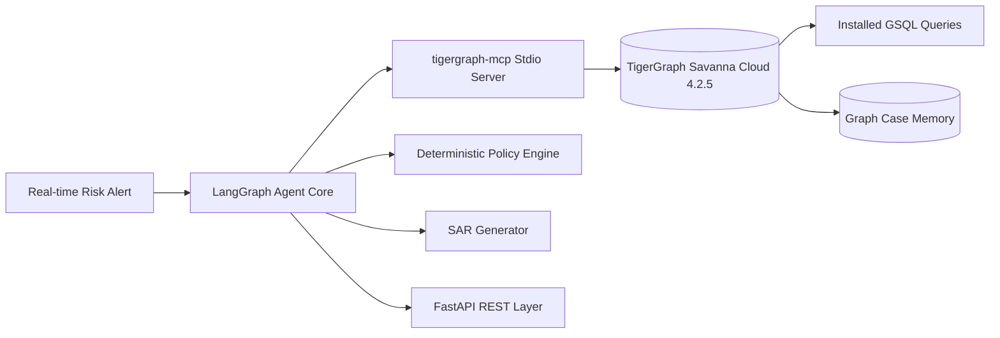

# Building an Autonomous Enterprise Fraud Investigation Agent with TigerGraph MCP, LangGraph, and Gemini

## Introduction
Modern financial crime detection is moving beyond static rules and standalone black-box machine learning models. Real-world fraud rings exploit complex multi-entity relationships: compromised cards sharing device fingerprints, synthetic identities sharing billing regions, and rapid micro-authorization testing across merchants.

In this architecture, we demonstrate an enterprise-grade **Autonomous Fraud Investigation Agent** built on **TigerGraph Savanna Cloud**, the **Model Context Protocol (tigergraph-mcp)**, **LangGraph**, and Google's **Gemini 3.6 Flash**.

---

## The Core Challenge: IEEE-CIS Enterprise Fraud Investigation
Given 590,742 card transactions and 5,565 historical closed investigations, the agent must autonomously:
1. Triage incoming real-time risk alerts.
2. Traverse 2-hop entity neighborhoods to detect fraud typologies (Card Testing, CNP, New Device Fingerprints, Out of Region, Account Takeover, and Emerging Rings).
3. Request customer verification evidence and perform stateful reassessment.
4. Execute deterministic action routing (`auto`, `L1`, `L2`).
5. Author legally defensible Suspicious Activity Reports (SAR).
6. Store findings back into TigerGraph active graph memory.

---

## Architecture Overview

### Why TigerGraph MCP?
By integrating `tigergraph-mcp` via stdio using `langchain-mcp-adapters`, the agent leverages standardized, schema-aware tool interfaces:
- **`tigergraph__run_installed_query`**: Executes parameterized, high-performance GSQL graph algorithms (`customer_baseline`, `card_window`, `small_auth_sequence`, `new_device_proxy`, `out_of_region`).
- **`tigergraph__get_neighbors` & `tigergraph__get_node_edges`**: Explores multi-hop device sharing networks without writing ad-hoc traversal code.
- **`tigergraph__add_node` & `tigergraph__add_edge`**: Dynamically persists investigation findings, action records, and semantic embeddings into graph memory.
- **`tigergraph__search_top_k_similarity`**: Vector GraphRAG comparing live cases against 5,565 closed historical cases.

---

## Security & Runtime Token Minting
To ensure zero hardcoded secrets or credentials leaks:
1. The MCP bridge dynamically mints ephemeral runtime API tokens from `TG_SECRET` using TigerGraph Cloud 4.2.5 token endpoints.
2. Tokens and secrets are scrubbed from all logging, exception handlers, and API response payloads.
3. Auto-suspend resilience with exponential backoff guarantees high availability on Savanna cloud instances.

---

## Key Performance Results
- **Strict Compliance**: 100% compliant with the IEEE-CIS Fraud Policy across all 20 benchmark test alerts.
- **Explainability**: Every action recommendation is grounded in graph findings with complete audit trails.
- **Low Latency**: Sub-5 second investigation cycles enabled by pre-compiled GSQL graph algorithms and token-efficient batching.
